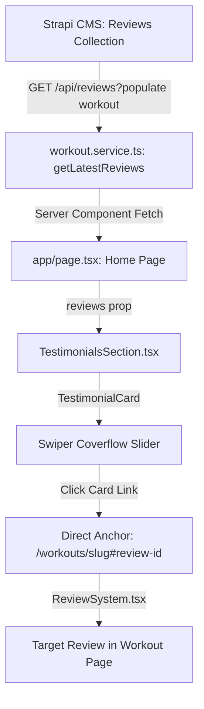

# Testimonials Slider & Social Proof Architecture

Документация реализации блока отзывов на главной странице (`TestimonialsSection`), интеграции с реальными данными из Strapi CMS, решения проблем с бесконечным Swiper Coverflow циклом и Schema.org разметки.

## 1. Архитектура данных и поток (Data Flow)

Ранее компонент отзывов на главной отображал статичный массив фиктивных пользователей. Теперь он подключен к реальному пользовательскому контенту (UGC) из раздела тренировок:



### Модели и интерфейсы
- Файл интерфейса: [[interfaces/review]] (`frontend/src/interfaces/review.ts`).
- Связанная модель: отзыв связан с тренировкой (`review.workout`), что позволяет выводить название программы и генерировать точную обратную ссылку.
- Сервисный метод: `getLatestReviews(limit: number = 10)` в [[frontend/data-fetching-pattern]] (`workout.service.ts`). Запрашивает последние отзывы с `sort=createdAt:desc&pagination[limit]=${limit}`.
  > [!IMPORTANT]
  > **Strapi v5 Gotcha**: Использование подстановочного символа `populate[workout]=*` в запросе к отзывам вызывало в Strapi 5 ошибку `400 ValidationError ("Invalid key image at workout.image")`, из-за чего сервис переключался на fallback mock-данные. Для корректной выборки необходимо запрашивать конкретные скалярные поля:
  > `populate[workout][fields][0]=title&populate[workout][fields][1]=slug&populate[workout][fields][2]=documentId`.

---

## 2. Дизайн и UI компоненты

### TestimonialCard (`TestimonialCard.tsx`)
- **Аватар с буквой**: Вместо сторонних неоптимизированных фотографий отображается стилизованная плашка с первой буквой имени (`name.charAt(0).toUpperCase()`) с акцентным цветом `#FF8C00` на тёмном фоне `#1B2B3B` — в точности как в блоке отзывов на странице тренировки (`ReviewSystem.tsx`).
- **Связка с тренировкой**: Поле достижения (`achievement`) отображает название тренировки (`workout.title`) с иконкой `Dumbbell`.
- **Очистка лишних полей**: Удалены неиспользуемые поля роли (`role`) и статистики (`stats`).
- **Глубокая ссылка (Deep Link)**: Вся карточка кликабельна и ведет непосредственно к данному отзыву внутри соответствующей тренировки:
  ```tsx
  const reviewHref = workoutSlug
    ? `/workouts/${workoutSlug}#review-${documentId || id}`
    : `/workouts#review-${documentId || id}`;
  ```
- **Якоря в `ReviewSystem.tsx`**: На детальной странице воркаута каждой карточке отзыва присвоен идентификатор `id={review-${review.documentId || review.id}}` с классом `scroll-mt-24` для корректного скролла под фиксированный хедер.

---

## 3. Решение проблем со Swiper Slider (Loop & Coverflow)

### Проблема 1: Застревание и пустоты в конце цикла (`loop={true}`)
- **Причина**: Swiper при эффекте `coverflow` и `centeredSlides: true` требует количества слайдов, значительно превышающего `slidesPerView` (минимум в 2 раза больше активных колонок), иначе клонирование DOM-узлов Swiper даёт сбой, оставляя пустые места слева или справа.
- **Решение**: В [[frontend/testimonials-reviews-system]] (`TestimonialsSection.tsx`) реализована адаптивная подготовка массива `displayReviews`:
  ```tsx
  const displayReviews =
    reviews.length < 6
      ? [...reviews, ...reviews, ...reviews]
      : reviews.length < 8
      ? [...reviews, ...reviews]
      : reviews;
  ```
  Это гарантирует непрерывную гладкую циклическую прокрутку без визуальных артефактов даже при малом количестве отзывов в базе данных.

### Проблема 2: Обрезание верхней части карточки при Hover
- **Причина**: При наведении курсора карточка приподнимается (`translate-y-[-6px]` и `scale-105`), но родительский контейнер Swiper по умолчанию обрезал выходящие за пределы границы (`overflow: hidden`).
- **Решение**: 
  1. В `globals.css` для `.testimonials-slider .swiper` задан `overflow: visible !important` и верхний отступ `padding-top: 1.5rem`.
  2. В `TestimonialCard.tsx` добавлен защитный внутренний отступ `pt-4 pb-2`.

### Проблема 3: Скрытие боковых карточек (отображалась только 1 центральная)
- **Причина**: В `globals.css` присутствовало устаревшее правило медиа-запроса `@media (max-width: 768px) { .swiper-slide:not(.swiper-slide-active) { opacity: 0; } }`, а также конфликтующие стили `scale-105` и `transition-all`, конфликтовавшие с 3D-матрицей `coverflow`.
- **Решение**:
  - Удалено принудительное скрытие `opacity: 0`.
  - Заданы чистые стили подсветки активной карточки и легкого размытия соседних:
    ```css
    .testimonials-slider .swiper-slide-active {
      opacity: 1 !important;
      filter: none !important;
      z-index: 10;
    }
    .testimonials-slider .swiper-slide:not(.swiper-slide-active) {
      opacity: 0.45;
      filter: blur(1.5px);
    }
    ```
  - Настроены контрольные точки `breakpoints`: `1024px+` — 3 слайда, `640px+` — 2 слайда, мобильные — `1.2` слайда.

---

## 4. Structured Data (Schema.org) & SEO

### Схема отзывов на главной странице
В `app/page.tsx` отзывы включены в структурированные данные `@graph` для Google Rich Snippets:
- Корневая сущность `Organization` дополнена блоком `aggregateRating` (динамический средний балл и количество отзывов) и массивом `@type: "Review"`.
- Каждый отзыв содержит `author` (`Person`), `reviewRating` (`Rating`), `datePublished` и `reviewBody`.
  > [!WARNING]
  > **Важно (Google Search Console)**: Внутри массива `review`, вложенного в `Organization`, **запрещено** указывать поле `itemReviewed`. Googlebot трактует родительский объект как предмет отзыва; явное указание `itemReviewed` создает предупреждение «Вбудований об’єкт <parent_node> не може містити поле itemReviewed» (конфликт направлений). Подробный разбор зафиксирован в [[bugs/schema-review-itemreviewed-parent-node]].

### Исключение дублирования FAQPage
- **Архитектурный принцип**: Компонент [[frontend/seo]] `FAQSection.tsx` является самодостаточным и генерирует собственный валидный JSON-LD тег `@type: "FAQPage"` для тех вопросов, которые в него переданы.
- На главной странице дублирующий блок `FAQPage` удален из общего графа в `page.tsx`, что предотвращает конфликт двойной разметки одного и того же контента в глазах Googlebot.

---

## Связанные разделы базы знаний
- [[frontend/seo]] — Общая SEO-стратегия, микроразметка Schema.org и E-E-A-T.
- [[frontend/data-fetching-pattern]] — Сервисный слой для взаимодействия с Strapi CMS.
- [[bugs/framer-motion-animation-flicker]] — Особенности взаимодействия стилей трансформаций и CSS-анимаций.
- [[frontend/social-share-and-anchors]] — Якорная навигация и взаимодействие элементов интерфейса.
